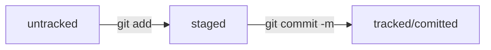

<h1 align="center">Install GIT</h1>
<CODE>brew install git</CODE>
<h3 align="center">Add directory to GIT</h3>

<i>Go to directory: </i>
<CODE>cd 'directory path'</CODE> 
<CODE>git init</CODE> 
<i>Сheck status: </i>
<CODE>git status</CODE> (untracked/tracked, staged & modified)

<h3 align="center">Adding changes</h3>

<CODE>git add 'name files'</CODE> 
<CODE>git add --all</CODE> 
<CODE>git add .</CODE> 

<h3 align="center">Save changes</h3>
<CODE>git commit -m 'message about changes' </CODE>
<h3 align="center">Cheсk version log</h3>

<CODE>git log</CODE> full log 
<CODE>git log --oneline</CODE> abbreviated log

<h1 align="center"><a href="https://github.com">GitHub</a></h1>
<h3 align="center">Create SSH key</h3>

<i>Go to home directory</i> 
<CODE>ssh-keygen -t ed25519 -C rbalavin@gmail.com</CODE> 
<CODE>ls -a .ssh/</CODE> 
<i>Copy public key</i> 
<CODE>pbcopy < ~/.ssh/id_ed25519.pub</CODE> 
<i>Paste the public key in your <a href="https://github.com">GitHub</a> profile settings</i>

<h3 align="center">Create repository on <a href="https://github.com">GitHub</a></h3>

<i>Go to directory</i> 
<CODE>cd 'directory path'</CODE> 
<CODE>git remote add origin git@github.com:rbalavin/'name repository'.git</CODE> 
<CODE>git push -u origin master</CODE> first 
<CODE>git push</CODE> second

<h3 align="center">Chenge commit</h3>

1) <CODE>--amend</CODE> calculation to work with the last commit (<CODE>HEAD</CODE>). 
2) You can add new files to a commit using <CODE>git commit --amend --no-edit</CODE>. Thanks to the <CODE>--no-edit</CODE> option, the commit message will remain as it was 
3) The command <CODE>git commit --amend -m "Updated commit message"</CODE> allows you to change the commit message.

